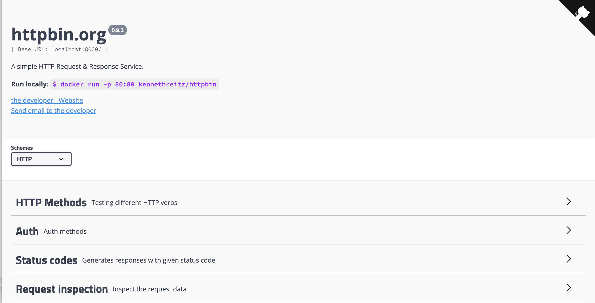

# 范例教学

> `urllib.urlopen(url[,data[,proxies]])` : [https://docs.python.org/2/library/urllib.html](https://docs.python.org/2/library/urllib.html)

- `Github` 源码地址: [https://github.com/snowdreams1006/learn-python/edit/master/docs/url/urllib/teaching.md](https://github.com/snowdreams1006/learn-python/edit/master/docs/url/urllib/teaching.md)
- `Github` 在线地址: [https://snowdreams1006.github.io/learn-python/url/urllib/teaching.html](https://snowdreams1006.github.io/learn-python/url/urllib/teaching.html)

## 文章目录

<!-- toc -->

## 演示环境搭建

本文使用的 `python` 环境是基于 `virtualenv` 实现的虚拟环境,只是为了方便隔离不同环境,更好模拟真实用户环境.

实际开发中,可以跟着本文一步一步操作练习搭建开发环境,也可以直接使用系统默认环境.

### 环境演示

演示环境相关信息如下:

```bash
(.env)$ python --version
Python 2.7.16
(.env) $ pip --version
pip 19.3.1 from ~/python/src/url/urllib/.env/lib/python2.7/site-packages/pip (python 2.7)
```

> 以下代码在该环境运行正常,但是并不保证其他环境与演示结果一致,所以一切还是以实际运行结果为准.

### 环境搭建

如果不需要虚拟环境的话,可以忽略环境安装这一部分内容,直接使用默认环境即可,只需要保证测试时使用的 `python` 版本是 `python2` 而非 `python3`!

- 步骤1. 安装虚拟环境 `virtualenv` 

```bash
sudo pip install virtualenv
```

> 安装虚拟环境方便隔离不同 python 环境,也可以使用**系统默认环境**,所以这一步是可选的,同理下面的步骤也都是可选的.


- 步骤2. 准备虚拟环境目录 `.env`

```bash
virtualenv .env
```

> 虚拟环境目录设置成隐藏目录的目的是防止误操作,当然也可以设置成普通目录那样显示出来.

- 步骤3. 激活虚拟环境 `.env`

```bash
source .env/bin/activate
```

> 一旦准备好虚拟环境目录后就需要激活该虚拟环境,这一步可以重复操作,不会报错!

- 步骤4. 查看当前正在使用的 `python` 与 `pip` 版本

```bash
(.env) $ which python
~/python/src/url/urllib/.env/bin/python
(.env) snowdreams1006s-MacBook-Pro:urllib snowdreams1006$ which pip
~/python/src/url/urllib/.env/bin/pip
```

> 激活虚拟环境后会自动下载相关的 `python` 依赖,因此 `python` 和 `pip` 文件位置正是当前目录 `.env` 而不是系统默认环境,如果未开启虚拟环境则显示的是系统目录.

## 原生网络请求 urllib 库

如果读者亲测运行时发现网络无法正常请求,可以将 [http://httpbin.snowdreams1006.cn/ ](http://httpbin.snowdreams1006.cn/) 替换成 [http://httpbin.org/](http://httpbin.org/) 或者自行搭建本地测试环境.

下面提供两种搭建本地测试环境的安装方式,当然也可以访问 [http://httpbin.snowdreams1006.cn/](http://httpbin.snowdreams1006.cn/) 或者 [http://httpbin.org/](http://httpbin.org/) 等在线环境.

- `docker` 安装方式



```bash
docker run -p 8000:80 kennethreitz/httpbin
```

> 首次运行会先将镜像下载到本地再启动容器,非首次运行会直接启动容器,访问地址: [http://127.0.0.1:8000/](http://127.0.0.1:8000/)

- `python` 安装方式


```bash
pip install gunicorn httpbin && gunicorn httpbin:app
```

> 默认监听端口是 `8000`,如果遇到端口冲突提示已被占用,可运行 `gunicorn httpbin:app -b :9898` 指定端口.

### 怎么发送最简单的网络请求

> `urllib2.urlopen(url)` : 发送最简单的网络请求,直接返回响应体文本数据.

新建 `python` 文件名为 `urllib_demo.py`,核心代码包括先导入 `urllib2` 包,然后使用 `urllib2.urlopen()` 即可发送最简单的 `GET` 请求,最后利用 `response.read()` 可**一次性读取**响应体内容.

代码内容如下:

```python
# -*- coding: utf-8 -*-
import urllib
import urllib2

def use_simple_urllib2():
    '''
    获取请求方信息
    '''
    response = urllib2.urlopen('http://httpbin.snowdreams1006.cn/get')
    print response.read()

if __name__ == '__main__':
    print '>>>Use simple urllib2:'
    use_simple_urllib2()
```

> 假如该文件名为 `urllib_demo.py` ,则在终端命令行内运行 `python urllib_demo.py` 即可查看输出结果.

### 怎么知道有哪些属性和方法

> `print type(response)` : 获取对象**类型**,配合基本类型可大致猜测出有哪些方法和属性可供外部调用.
> `print dir(response)` : 获取对象方法和属性**枚举值**,无文档猜测方法和属性.

通过 `urllib2.urlopen(url)` 已经可以发送最简单的网络请求了, 无论是 `GET` 请求还是 `POST` 请求,获取请求后的响应体无疑是非常重要的,但实际开发中同样不可忽略的是还有其他方法和属性.

因此,除了掌握 `response.read()` 一次性全部读取响应体内容之外,还需要知道 `response` 有哪些属性和方法.

通过 `type(response)` 获取对象类型再配合 `dir(response)` 获取属性枚举值即可**无文档大致猜测**对象有哪些可供调用的属性和方法.

```python
# -*- coding: utf-8 -*-
import urllib2

def use_simple_urllib2():
    '''
    获取请求方信息
    '''
    response = urllib2.urlopen('http://httpbin.snowdreams1006.cn/get')
    print type(response)
    print dir(response)

if __name__ == '__main__':
    print '>>>Use simple urllib2:'
    use_simple_urllib2()
```

下面是 `print type(response)` 和 `print dir(response)` 的输出内容,接下来将挑选出常用的属性和方法慢慢讲解.

```bash
# print type(response)
<type 'instance'>

# print dir(response)
['__doc__', '__init__', '__iter__', '__module__', '__repr__', 'close', 'code', 'fileno', 'fp', 'getcode', 'geturl', 'headers', 'info', 'msg', 'next', 'read', 'readline', 'readlines', 'url']
```

- 响应对象的状态码(属性)

> `response.code` : 获取响应对象的状态码,正常情况下是 `200` 表示请求成功,而 `500` 是典型的系统错误.

通过 `dir(response)` 获取属性枚举值,结合 `type(response)` 不难发现 `response.code` 是用来获取响应状态码的,具体调用方式是 `response.code` 还是 `response.code()` 可运行 `print type(response.code)` 大致推断.

```python
# -*- coding: utf-8 -*-
import urllib2

def use_simple_urllib2():
    '''
    获取请求方信息
    '''
    response = urllib2.urlopen('http://httpbin.snowdreams1006.cn/get')
    print type(response.read)
    print type(response.code)

if __name__ == '__main__':
    print '>>>Use simple urllib2:'
    use_simple_urllib2()
```

> 这里不妨结合 `print type(response.read)` 是方法来验证输出结果到底是属性还是方法,可以看出 `response.read` 是 `<type 'instancemethod'>` 方法类型,而 `response.code` 是 `<type 'int'>` 基本类型,因此 `response.code` 是属性调用方式.

`type(response.code)` 的输出结果是 `<type 'int'>` 并不是 `<type 'instancemethod'>`,因此获取状态码的方式是属性调用.

详细代码如下:

```python
# -*- coding: utf-8 -*-
import urllib2

def use_simple_urllib2():
    '''
    获取请求方信息
    '''
    response = urllib2.urlopen('http://httpbin.snowdreams1006.cn/get')
    print response.code

if __name__ == '__main__':
    print '>>>Use simple urllib2:'
    use_simple_urllib2()
```

- 响应对象的状态码(方法)

> `response.getcode()` : 获取响应对象的状态码,正常情况下是 `200` 表示请求成功,而 `500` 是典型的系统错误.

同样地,从 `print dir(response)` 可知 `getcode` 字段可供调用,但不知道是属性调用还是方法调用?再次使用 `
print type(response.getcode)` 得到 `<type 'instancemethod'>` 因而判定为方法调用形式.

详情代码如下:

```python
# -*- coding: utf-8 -*-
import urllib2

def use_simple_urllib2():
    '''
    获取请求方信息
    '''
    response = urllib2.urlopen('http://httpbin.snowdreams1006.cn/get')
    print response.getcode()

if __name__ == '__main__':
    print '>>>Use simple urllib2:'
    use_simple_urllib2()
```

- 响应对象的状态码信息(属性)

> `response.msg` : 获取响应对象的状态描述信息,例如状态码 `200` 对于 `OK`,而 `500` 对于 `INTERNAL SERVER ERROR`.

```python
# -*- coding: utf-8 -*-
import urllib2

def use_simple_urllib2():
    '''
    获取响应状态码
    '''
    response = urllib2.urlopen('http://httpbin.snowdreams1006.cn/status/200')
    print response.code
    print response.msg

    response = urllib2.urlopen('http://httpbin.snowdreams1006.cn/status/500')
    print response.code
    print response.msg

if __name__ == '__main__':
    print '>>>Use simple urllib2:'
    use_simple_urllib2()
```

> 正常请求状态是 `200 OK`,而请求发生异常很可能是 `500 INTERNAL SERVER ERROR` ,一旦出现异常如若异常处理则会报错,程序终止运行.

- 响应对象的访问链接(属性)

> `response.url` : 获取请求链接.

```python
# -*- coding: utf-8 -*-
import urllib2

def use_simple_urllib2():
    '''
    获取请求方信息
    '''
    response = urllib2.urlopen('http://httpbin.snowdreams1006.cn/get')
    print response.url

if __name__ == '__main__':
    print '>>>Use simple urllib2:'
    use_simple_urllib2()
```

- 响应对象的访问链接(方法)

> `response.geturl()` : 获取请求链接.

```python
# -*- coding: utf-8 -*-
import urllib2

def use_simple_urllib2():
    '''
    获取请求方信息
    '''
    response = urllib2.urlopen('http://httpbin.snowdreams1006.cn/get')
    print response.geturl()

if __name__ == '__main__':
    print '>>>Use simple urllib2:'
    use_simple_urllib2()
```

- 响应对象的访问链接(属性)

> `response.headers.dict` : 获取请求头信息并以字典形式显示.

在某些情况下发送请求时必须携带特定的请求头方可成功,因此需要清楚默认不设置请求头时服务端接收到的请求头是什么样子的,同样地,可使用 `print type(response.headers)` 结合 `print dir(response.headers)` 自行探索可供调用的属性和方法.

```python
# -*- coding: utf-8 -*-
import urllib2

def use_simple_urllib2():
    '''
    获取请求方信息
    '''
    response = urllib2.urlopen('http://httpbin.snowdreams1006.cn/get')
    print response.headers.dict

if __name__ == '__main__':
    print '>>>Use simple urllib2:'
    use_simple_urllib2()
```

- 响应对象的请求头信息(方法)

> `response.info()` : 获取请求头信息并以逐行显示

和上一个 `response.headers.dict` 获取请求头信息类似,只不过 `response.info()` 适合肉眼显示而非程序使用.

```python
# -*- coding: utf-8 -*-
import urllib2

def use_simple_urllib2():
    '''
    获取请求方信息
    '''
    response = urllib2.urlopen('http://httpbin.snowdreams1006.cn/get')
    print response.info()

if __name__ == '__main__':
    print '>>>Use simple urllib2:'
    use_simple_urllib2()
```

- 响应对象的响应体(方法)

> `response.read()` : 一次性读取响应体,适合响应体数据量比较小的情况,一次性全部读取到内存方便操作.

```python
# -*- coding: utf-8 -*-
import urllib2

def use_simple_urllib2():
    '''
    获取响应体信息
    '''
    response = urllib2.urlopen('http://httpbin.snowdreams1006.cn/get')
    print response.read()

if __name__ == '__main__':
    print '>>>Use simple urllib2:'
    use_simple_urllib2()
```

`response.read()` 返回的是字符串,因此可以很方便用变量接收作后续处理,例如 `result = response.read()` :

```python
# -*- coding: utf-8 -*-
import urllib2

def use_simple_urllib2():
    '''
    获取响应体信息
    '''
    response = urllib2.urlopen('http://httpbin.snowdreams1006.cn/get')
    result = response.read()
    print result

if __name__ == '__main__':
    print '>>>Use simple urllib2:'
    use_simple_urllib2()
```

- 响应对象的响应体(方法)

> `response.readline()` : 逐行读取响应体,适用于数据体比较大的情况,循环读取直到最终无数据可读取为止.

```python
# -*- coding: utf-8 -*-
import urllib2

def use_simple_urllib2():
    '''
    获取响应体信息
    '''
    response = urllib2.urlopen('http://httpbin.snowdreams1006.cn/get')
    line = response.readline()
    while line:
        print line
        line = response.readline()

if __name__ == '__main__':
    print '>>>Use simple urllib2:'
    use_simple_urllib2()
```

`response.readline()` 只能逐行读取,因此想要获取完成的响应体需要进行手动拼接,例如:

```python
# -*- coding: utf-8 -*-
import urllib2

def use_simple_urllib2():
    '''
    获取响应体信息
    '''
    response = urllib2.urlopen('http://httpbin.snowdreams1006.cn/get')
    result = ''
    line = response.readline()
    result = result + str(line)
    while line:
        line = response.readline()
        result = result + str(line)
    print result

if __name__ == '__main__':
    print '>>>Use simple urllib2:'
    use_simple_urllib2()
```

> `str(line)` 是为了保证响应体字符串一定是字符串类型,其实应该不必如此,`response.readline()` 本身已经是字符串类型了.

- 响应对象的响应体(方法)

> `response.readlines()` : 遍历读取响应体,循环读取且保存到列表对象中,适合需要逐行处理情况.

```python
# -*- coding: utf-8 -*-
import urllib2

def use_simple_urllib2():
    '''
    获取响应体信息
    '''
    response = urllib2.urlopen('http://httpbin.snowdreams1006.cn/get')
    for line in response.readlines():
        print line

if __name__ == '__main__':
    print '>>>Use simple urllib2:'
    use_simple_urllib2()
```

同样地,如果需要针对 `response.readlines()` 方式获取完整响应体结果,可以如下进行拼接,示例如下:

```python
# -*- coding: utf-8 -*-
import urllib2

def use_simple_urllib2():
    '''
    获取响应体信息
    '''
    response = urllib2.urlopen('http://httpbin.snowdreams1006.cn/get')
    result = ''
    for line in response.readlines():
        result = result + str(line)
    print result

if __name__ == '__main__':
    print '>>>Use simple urllib2:'
    use_simple_urllib2()
```

> 上述多行代码还可以进一步转换成一行代码: `result = ''.join([line for line in response.readlines()])`

### 如何发送普通 `GET` 请求

- 无参数直接发送

> [urllib2.urlopen(url)](urllib2.urlopen(url)) : 只需要一个目标 `URL` 即可发送 `GET` 请求.

最简单的请求方式也就是 `GET` 方式,不设置其他参数的情况下,只需要填写 `URL` 即可发送请求,例如 `urllib2.urlopen('http://httpbin.snowdreams1006.cn/get')`,示例代码如下:

```python
# -*- coding: utf-8 -*-
import urllib
import urllib2

def use_simple_urllib2():
    '''
    获取响应头和响应体信息
    '''
    response = urllib2.urlopen('http://httpbin.snowdreams1006.cn/get')
    print('>>>Response Headers:')
    print(response.info())
    print('>>>Response Body:')
    print(response.read())

if __name__ == '__main__':
    print '>>>Use simple urllib2<<<'
    use_simple_urllib2()
```

假如上述代码文件名为 `urllib_demo.py`,在终端命令行内运行 `python urllib_demo.py` 文件,输出结果如下所示:

```bash
(.env) $ python urllib_demo.py 
>>>Use simple urllib2<<<
>>>Response Headers:
Server: nginx/1.17.6
Date: Thu, 16 Jan 2020 13:38:27 GMT
Content-Type: application/json
Content-Length: 263
Connection: close
Access-Control-Allow-Origin: *
Access-Control-Allow-Credentials: true

>>>Response Body:
{
  "args": {}, 
  "headers": {
    "Accept-Encoding": "identity", 
    "Connection": "close", 
    "Host": "httpbin.snowdreams1006.cn", 
    "User-Agent": "Python-urllib/2.7"
  }, 
  "origin": "218.205.55.192", 
  "url": "http://httpbin.snowdreams1006.cn/get"
}
```

其中响应头 `Connection: close` 表明连接是自动关闭的,而响应体 `args` 是空字典表明没有查询参数.

- 有参数转码发送

实际开发过程中,很少有 `GET` 请求不需要携带参数的,对于有参数查询的 `GET` 请求,原生 `urllib` 也是支持的,最简单的做法是将查询参数拼接到目标 `URL` 上得到带有查询参数的 `URL`.

```python
# -*- coding: utf-8 -*-
import urllib
import urllib2

def use_params_urllib2():
    '''
    获取响应头和响应体信息
    '''
    response = urllib2.urlopen('http://httpbin.snowdreams1006.cn/get?param1=hello&param2=world')
    print('>>>Response Headers:')
    print(response.info())
    print('>>>Response Body:')
    print(response.read())

if __name__ == '__main__':
    print '>>>Use params urllib2<<<'
    use_params_urllib2()
```

同样地,假如上述代码文件名为 `urllib_demo.py`,在终端命令行内运行 `python urllib_demo.py` 文件,输出结果如下所示:

```bash
(.env) $ python urllib_demo.py 
>>>Use params urllib2<<<
>>>Response Headers:
Server: nginx/1.17.6
Date: Thu, 16 Jan 2020 13:59:23 GMT
Content-Type: application/json
Content-Length: 338
Connection: close
Access-Control-Allow-Origin: *
Access-Control-Allow-Credentials: true

>>>Response Body:
{
  "args": {
    "param1": "hello", 
    "param2": "world"
  }, 
  "headers": {
    "Accept-Encoding": "identity", 
    "Connection": "close", 
    "Host": "httpbin.snowdreams1006.cn", 
    "User-Agent": "Python-urllib/2.7"
  }, 
  "origin": "218.205.55.192", 
  "url": "http://httpbin.snowdreams1006.cn/get?param1=hello&param2=world"
}
```

其中响应头 `Connection: close` 表明连接是自动关闭的,而响应体 `args` 不再是空字典而是刚才传递的查询参数表明服务端确实接收到发送的查询参数了,所以这种方式也是可行的.

如果查询参数非常多,直接在请求链接 `URL` 基础上拼接形成新的 `URL` 将会显示非常繁琐,而且必须遵守 `?param1=hello&param2=world` 这种格式,所以这种繁琐的拼接工作就交给程序去完成吧!

```python
# -*- coding: utf-8 -*-
import urllib
import urllib2

def use_params_urllib2():
    '''
    获取响应头和响应体信息
    '''
    response = urllib2.urlopen('http://httpbin.snowdreams1006.cn/get?param1=hello&param2=world&author=snowdreams1006&website=http://blog.snowdreams1006.cn&url=snowdreams1006.github.io/learn-python/url/urllib/teaching.html&wechat=snowdreams1006&email=snowdreams1006@163.com&github=https://github.com/snowdreams1006/')
    print('>>>Response Headers:')
    print(response.info())
    print('>>>Response Body:')
    print(response.read())

if __name__ == '__main__':
    print '>>>Use params urllib2<<<'
    use_params_urllib2()
```

上述繁琐不仅体现在拼接成新的 `URL` 时长度过长容器出错,还会遇到动态查询参数替换的问题,所以自动拼接查询参数功能真的是及时雨!

```python
params = urllib.urlencode({
    'param1': 'hello', 
    'param2': 'world',
    'author':'snowdreams1006',
    'website':'http://blog.snowdreams1006.cn',
    'url':'https://snowdreams1006.github.io/learn-python/url/urllib/teaching.html',
    'wechat':'snowdreams1006',
    'email':'snowdreams1006@163.com',
    'github':'https://github.com/snowdreams1006/'
})
print params
```

`urllib.urlencode()` 可以将字典类型的查询参数转码拼接成 `&` 连接的查询参数,之后再手动拼接到请求 `URL?params` 即可得到带参数的 `URL`.

```python
# -*- coding: utf-8 -*-
import urllib
import urllib2

def use_params_urllib2():
    params = urllib.urlencode({
        'param1': 'hello', 
        'param2': 'world',
        'author':'snowdreams1006',
        'website':'http://blog.snowdreams1006.cn',
        'url':'https://snowdreams1006.github.io/learn-python/url/urllib/teaching.html',
        'wechat':'snowdreams1006',
        'email':'snowdreams1006@163.com',
        'github':'https://github.com/snowdreams1006/'
    })
    response = urllib2.urlopen('http://httpbin.snowdreams1006.cn/get?%s' % params)
    print('>>>Response Headers:')
    print(response.info())
    print('>>>Response Body:')
    print(response.read())

if __name__ == '__main__':
    print '>>>Use params urllib2<<<'
    use_params_urllib2()
```

假如上述代码文件名为 `urllib_demo.py`,在终端命令行内运行 `python urllib_demo.py` 文件,输出结果如下所示:

```bash
$ python urllib_demo.py 
>>>Use params urllib2<<<
>>>Response Headers:
Server: nginx/1.17.6
Date: Thu, 16 Jan 2020 14:27:21 GMT
Content-Type: application/json
Content-Length: 892
Connection: close
Access-Control-Allow-Origin: *
Access-Control-Allow-Credentials: true

>>>Response Body:
{
  "args": {
    "author": "snowdreams1006", 
    "email": "snowdreams1006@163.com", 
    "github": "https://github.com/snowdreams1006/", 
    "param1": "hello", 
    "param2": "world", 
    "url": "https://snowdreams1006.github.io/learn-python/url/urllib/teaching.html",
    "website": "http://blog.snowdreams1006.cn", 
    "wechat": "snowdreams1006"
  }, 
  "headers": {
    "Accept-Encoding": "identity", 
    "Connection": "close", 
    "Host": "httpbin.snowdreams1006.cn", 
    "User-Agent": "Python-urllib/2.7"
  }, 
  "origin": "218.205.55.192", 
  "url": "http://httpbin.snowdreams1006.cn/get?website=http%3A%2F%2Fblog.snowdreams1006.cn&github=https%3A%2F%2Fgithub.com%2Fsnowdreams1006%2F&wechat=snowdreams1006&param2=world&param1=hello&author=snowdreams1006&url=https%3A%2F%2Fsnowdreams1006.github.io%2Flearn-python%2Furl%2Furllib%2Fteaching.html&email=snowdreams1006%40163.com"
}
```

由此可见,不论是直接手动拼接查询参数还是使用 `urllib.urlencode(query)` 半手动拼接查询参数,本质上都是一样的,依然是使用 `urllib2.urlopen(url)` 发送 `GET` 请求.

### 如何发送普通 `POST` 请求

如果请求链接 `URL` 仅仅支持 `POST` 请求,这时上述拼接地址实现的 `GET` 请求就不再满足要求,有意思的是,竟然只需要一步就可以将 `GET` 请求转换成 `POST` 请求.

如果是 `GET` 请求,发送请求时是这样: `urllib2.urlopen('http://httpbin.snowdreams1006.cn/post?%s' % params)`;

如果是 `POST` 请求,发送请求时是这样: `urllib2.urlopen('http://httpbin.snowdreams1006.cn/post',params)`;

```python
def post_params_urllib2():
    '''
    获取响应头和响应体信息
    '''
    params = urllib.urlencode({
        'param1': 'hello', 
        'param2': 'world',
        'author':'snowdreams1006',
        'website':'http://blog.snowdreams1006.cn',
        'url':'https://snowdreams1006.github.io/learn-python/url/urllib/teaching.html',
        'wechat':'snowdreams1006',
        'email':'snowdreams1006@163.com',
        'github':'https://github.com/snowdreams1006/'
    })
    response = urllib2.urlopen('http://httpbin.snowdreams1006.cn/post',params)
    print('>>>Response Headers:')
    print(response.info())
    print('>>>Response Body:')
    print(response.read())

if __name__ == '__main__':
    print '>>>Post params urllib2<<<'
    post_params_urllib2()
```

由于 `GET` 请求和 `POST` 请求方式实在太像了,因此需要留意发送请求时 `urllib2.urlopen(url)` 中链接 `URL` 到底是怎么拼接的?

不过更加直观的方法就是发送请求直接验证,示例如下:

```bash
(.env) $ python urllib_demo.py 
>>>Post params urllib2<<<
>>>Response Headers:
Server: nginx/1.17.6
Date: Thu, 16 Jan 2020 14:45:43 GMT
Content-Type: application/json
Content-Length: 758
Connection: close
Access-Control-Allow-Origin: *
Access-Control-Allow-Credentials: true

>>>Response Body:
{
  "args": {}, 
  "data": "", 
  "files": {}, 
  "form": {
    "author": "snowdreams1006", 
    "email": "snowdreams1006@163.com", 
    "github": "https://github.com/snowdreams1006/", 
    "param1": "hello", 
    "param2": "world", 
    "url": "https://snowdreams1006.github.io/learn-python/url/urllib/teaching.html",
    "website": "http://blog.snowdreams1006.cn", 
    "wechat": "snowdreams1006"
  }, 
  "headers": {
    "Accept-Encoding": "identity", 
    "Connection": "close", 
    "Content-Length": "285", 
    "Content-Type": "application/x-www-form-urlencoded", 
    "Host": "httpbin.snowdreams1006.cn", 
    "User-Agent": "Python-urllib/2.7"
  }, 
  "json": null, 
  "origin": "218.205.55.192", 
  "url": "http://httpbin.snowdreams1006.cn/post"
}
```

值得注意的是,上述 `POST` 请求提交的参数存放在 `form` 属性而不是 `GET` 请求时的 `args` 属性.

### 如何设置代理进行网络请求

#### 环境搭建

如果 [http://proxyip.snowdreams1006.cn/](http://proxyip.snowdreams1006.cn/) 无法访问,可以访问[https://github.com/jhao104/proxy_pool](https://github.com/jhao104/proxy_pool)项目自行构建代理池.


```json
{
  "delete?proxy=127.0.0.1:8080": "delete an unable proxy", 
  "get": "get an useful proxy", 
  "get_all": "get all proxy from proxy pool", 
  "get_status": "proxy number"
}
```

> 单机勿压,恶意访问会关小黑屋哟,推荐大家自行搭建本地环境,谢谢支持.

本代理池是基于 [jhao104/proxy_pool](https://github.com/jhao104/proxy_pool)项目提供两种安装方式,分为 `docker` 安装方式和源码安装方式.

##### `docker` 方式安装

```bash
docker run --env db_type=REDIS --env db_host=127.0.0.1 --env db_port=6379 --env db_password='' -p 5010:5010 jhao104/proxy_pool
```

> 当然也可以提前下载镜像: `docker pull jhao104/proxy_pool`,然后再运行上述命令启动容器.

##### 源码方式安装

- 步骤 1 : 下载源码

```bash
git clone https://github.com/jhao104/proxy_pool.git
```

> 也可以直接下载安装包: [https://github.com/jhao104/proxy_pool/releases](https://github.com/jhao104/proxy_pool/releases)

- 步骤 2 : 安装依赖

```bash
pip install -r requirements.txt
```

> 安装项目依赖时需要切换到项目根目录,例如 `cd proxy_pool`,然后会自动从默认安装源进行下载,也可以是使用 `pip install -i https://pypi.tuna.tsinghua.edu.cn/simple -r requirements.txt` 加速安装.

- 步骤 3 : 配置 `Config/setting.py`

```python
# Config/setting.py 为项目配置文件

# 配置DB     
DATABASES = {
    "default": {
        "TYPE": "REDIS",        # 目前支持SSDB或REDIS数据库
        "HOST": "127.0.0.1",   # db host
        "PORT": 6379,          # db port，例如SSDB通常使用8888，REDIS通常默认使用6379
        "NAME": "proxy",       # 默认配置
        "PASSWORD": ""         # db password
    }
}

# 配置 API服务
SERVER_API = {
    "HOST": "0.0.0.0",  # 监听ip, 0.0.0.0 监听所有IP
    "PORT": 5010        # 监听端口
}
       
# 上面配置启动后，代理池访问地址为 http://127.0.0.1:5010
```

- 步骤 5 : 启动项目

``` bash
# 如果你的依赖已经安装完成并且具备运行条件,可以在cli目录下通过ProxyPool.py启动.
# 程序分为: schedule 调度程序 和 webserver Api服务

# 首先启动调度程序
python proxyPool.py schedule

# 然后启动webApi服务
python proxyPool.py webserver
```

> 该命令要求当前环境处于 `cli` 目录,如果是其他目录请自行调整 `proxyPool.py` 的路径(`cd cli` 即可切换到 `cli` 目录)

如果以上步骤均正常,项目启动会后自动抓取互联网免费代理 ip,可以通过访问 [http://127.0.0.1:5010](http://127.0.0.1:5010) 查看.

#### 设置代理

建议首先利用浏览器直接访问[http://proxyip.snowdreams1006.cn/get/](http://proxyip.snowdreams1006.cn/get/)查看是否能获取随机代理 ip,然后再利用 `python` 程序获取,保证代码运行正确,方便后续开发测试.

##### 获取随机代理 ip

```python
# -*- coding: utf-8 -*-
import urllib
import urllib2
import json

def get_proxy():
    '''
    获取随机代理
    '''
    response = urllib2.urlopen('http://proxyip.snowdreams1006.cn/get/')
    result = response.read()
    return json.loads(result)

if __name__ == '__main__':
    print '>>>Get proxy urllib<<<'
    get_proxy_urllib()
```

> 如果有浏览器环境,可以直接访问[http://proxyip.snowdreams1006.cn/get/](http://proxyip.snowdreams1006.cn/get/)验证是否能获取随机代理 ip,或者在终端命令行运行 `curl http://proxyip.snowdreams1006.cn/get/` 命令查看结果.

##### 设置代理ip访问

> `urllib.FancyURLopener(proxy)` : 设置代理 ip 信息实现间接访问

通过 `urllib.FancyURLopener(proxy)` 可设置代理,用于向服务端隐藏客户端的真实信息,但是服务端到底能否区分代理请求和普通请求是和代理 ip 有关的.

如果是高匿代理的话,是最为理想的一种情况,能够达到真正代理的作用.

相反,如果是透明代理的话,是最没用的代理,服务端不仅知道你正在使用代理还知道你真实 ip,有一种掩耳盗铃的错觉.

如何验证设置的代理 ip 是否能被服务端识别,可以访问[http://httpbin.snowdreams1006.cn/ip](http://httpbin.snowdreams1006.cn/ip)获取服务端读取到的客户端 ip.

```bash
$ curl http://httpbin.snowdreams1006.cn/ip
{
  "origin": "115.217.104.191"
}
```

> 如果终端命令行没 `curl` 命令,可以百度一下自行安装或者直接打开浏览器访问[http://httpbin.snowdreams1006.cn/ip](http://httpbin.snowdreams1006.cn/ip)

如果服务器读取到的请求 ip 和设置的代理 ip 一致,恭喜你,设置代理成功而且是高匿代理,否则的话,那就是掩耳盗铃了.

```python
# -*- coding: utf-8 -*-
import urllib
import urllib2
import json

def get_proxy():
    '''
    获取随机代理
    '''
    response = urllib2.urlopen('http://proxyip.snowdreams1006.cn/get/')
    result = response.read()
    return json.loads(result)

def get_proxy_urllib():
    '''
    通过代理发送请求
    '''
    # 随机代理 ip
    ip = get_proxy().get('proxy')
    print('>>>Get Proxy:')
    print(ip)
    proxy = {
        'http': 'http://{}'.format(ip),
        'https': 'https://{}'.format(ip)
    }
    opener = urllib.FancyURLopener(proxy)
    response = opener.open()
    print('>>>Response Headers:')
    print(response.info())
    print('>>>Response Body:')
    print(response.read())

if __name__ == '__main__':
    print '>>>Get proxy urllib<<<'
    get_proxy_urllib()
```

上述示例只是演示如何设置代理 ip 发送请求,并没有验证代理 ip 是否设置成功,即服务端读取到请求 ip 是否是刚刚设置的代理 ip,同时也没有考虑代理 ip 不可用或者连接超时等异常情况.

下面提供一个简单示例判断代理 ip 是否设置成功:

```json
{
    "proxy": "121.225.199.78:3128", 
    "fail_count": 0, 
    "region": "", 
    "type": "", "source": 
    "freeProxy09", 
    "check_count": 15, 
    "last_status": 1, 
    "last_time": "2020-01-17 12:03:29"
}
```

> 获取随机代理 ip 的一般格式,提取出随机 ip 的一般值为 `121.225.199.78:3128`

针对随机获取代理ip 的一般格式是带有端口号,而访问 [http://httpbin.snowdreams1006.cn/ip](http://httpbin.snowdreams1006.cn/ip) 获取到来源 ip 并不包括端口号,因此最简单的思路是截取随机 ip 去掉其端口号,然后再和访问结果作比较.

```python
'121.225.199.78:3128'.split(':')[0]
```

> 首先以 `:` 分割成两部分,然后只取第一部分,即获取不带端口号的 ip 地址: `121.225.199.78`

接下来由于 `response.read()` 获取到的响应体数据是字符串类型,不方便提取出其中 `origin` 对应的值,而响应体数据明显又是 `json` 格式,因此使用 `json.loads(result)` 可方便转换成 `python` 的字典类型.

```python
result = response.read()
result = json.loads(result)
proxyip = result.get('origin')
```

> 针对字典类型的取值方式不仅仅可以 `result.get('origin')` 也可以 `result['origin']` ,只不过当键名不存在时两者的表现不一致,建议使用方法取值.

现在最简单验证代理 ip 是否设置成功的完整示例如下:

```python
# -*- coding: utf-8 -*-
import urllib
import urllib2
import json

def get_proxy():
    '''
    获取随机代理
    '''
    response = urllib2.urlopen('http://proxyip.snowdreams1006.cn/get/')
    result = response.read()
    return json.loads(result)

def get_proxy_urllib():
    '''
    通过代理发送请求
    '''
    # 随机代理 ip
    ip = get_proxy().get('proxy')
    print('>>>Get Proxy:')
    print(ip)
    proxy = {
        'http': 'http://{}'.format(ip),
        'https': 'https://{}'.format(ip)
    }
    opener = urllib.FancyURLopener(proxy)
    response = opener.open()
    result = response.read()
    result = json.loads(result)
    response_ip = result.get('origin')
    proxy_ip = ip.split(':')[0]
    if proxy_ip == response_ip:
        print 'Proxy Success'
    else:
        print 'Proxy Fail'

if __name__ == '__main__':
    print '>>>Get proxy urllib<<<'
    get_proxy_urllib()
```

如果随机获取的代理 ip 正常的话,一般不会抛出异常,要么设置成功,要么设置失败.

```bash
(.env) $ python urllib_demo.py 
>>>Get proxy urllib<<<
>>>Get Proxy:
52.80.58.248:3128
Proxy Fail

(.env) $ python urllib_demo.py 
>>>Get proxy urllib<<<
>>>Get Proxy:
117.88.176.152:3000
Proxy Success
```

> 免费代理 ip 质量一般般,不要抱有太大幻想,实际开发过程中还是应该选择付费代理 ip.

##### 清除代理 ip 直连

> `urllib.FancyURLopener({})` : 清除代理 ip 信息实现直接访问

设置代理 ip 时需要传递给 `urllib.FancyURLopener(proxy)` 一个代理字典,清除代理信息时只需要将原来的代理字典设置成空对象即可.

主要代码和设置代理 ip 相差无二,不再赘述,可参考以下代码:

```python
# -*- coding: utf-8 -*-
import urllib
import urllib2
import json

def clear_proxy_urllib():
    '''
    清除代理后发送请求
    '''
    # 随机代理 ip
    ip = get_proxy().get('proxy')
    print('>>>Get Proxy:')
    print(ip)
    proxy = {
        'http': 'http://{}'.format(ip),
        'https': 'https://{}'.format(ip)
    }
    opener = urllib.FancyURLopener(proxy)
    response = opener.open("http://httpbin.snowdreams1006.cn/ip")
    print('>>>Response Headers:')
    print(response.info())
    print('>>>Response Body:')
    result = response.read()
    print(result)
    result = json.loads(result)
    response_ip = result.get('origin')
    proxy_ip = ip.split(':')[0]
    if proxy_ip == response_ip:
        print 'Set proxy success'
    else:
        print 'Set proxy fail'

    opener = urllib.FancyURLopener({})
    response = opener.open("http://httpbin.snowdreams1006.cn/ip")
    print('>>>Response Headers:')
    print(response.info())
    print('>>>Response Body:')
    result = response.read()
    print(result)
    result = json.loads(result)
    response_ip = result.get('origin')
    proxy_ip = ip.split(':')[0]
    if proxy_ip == response_ip:
        print 'Clear proxy fail'
    else:
        print 'Clear proxy success'

if __name__ == '__main__':
    print '>>>Get proxy urllib<<<'
    get_proxy_urllib()
```

除了上述方法使用 `urllib.FancyURLopener()` 设置或清除代理 ip,其实也可以使用 `urllib.urlopen()` 实现类似需求.

```python
# Use http://www.someproxy.com:3128 for HTTP proxying
proxies = {'http': 'http://www.someproxy.com:3128'}
filehandle = urllib.urlopen(some_url, proxies=proxies)

# Don't use any proxies
filehandle = urllib.urlopen(some_url, proxies={})

# Use proxies from environment - both versions are equivalent
filehandle = urllib.urlopen(some_url, proxies=None)
filehandle = urllib.urlopen(some_url)
```

其中关于环境变量的设置示例,如下:

```bash
% http_proxy="http://www.someproxy.com:3128"
% export http_proxy
% python
...
```

## 学习总结

本文主要介绍了 `python` 中原生的 `urllib` 如何**发送网络请求**以及一些基本环境的搭建过程,其中附带大量可直接操作的**现成代码**,文档和源码均已**开源**,感兴趣的小伙伴可自行[翻阅浏览](https://github.com/snowdreams1006/learn-python/tree/master/src/url/urllib).

现在简要回顾一下本文主要涉及到的重要知识点,以供后来者学习时快速翻阅查询.

### 虚拟环境 `virtualenv`

虚拟环境安装并激活成功后,`python` 和 `pip` 的版本信息如下:

```bash
(.env)$ python --version
Python 2.7.16
(.env) $ pip --version
pip 19.3.1 from ~/python/src/url/urllib/.env/lib/python2.7/site-packages/pip (python 2.7)
```

如需自行搭建该虚拟环境,可参考以下几步开启虚拟环境:

- 步骤1. 安装虚拟环境 `virtualenv` 

```bash
sudo pip install virtualenv
```

> 安装虚拟环境方便隔离不同 python 环境,也可以使用**系统默认环境**,所以这一步是可选的,同理下面的步骤也都是可选的.


- 步骤2. 准备虚拟环境目录 `.env`

```bash
virtualenv .env
```

> 虚拟环境目录设置成隐藏目录的目的是防止误操作,当然也可以设置成普通目录那样显示出来.

- 步骤3. 激活虚拟环境 `.env`

```bash
source .env/bin/activate
```

> 激活虚拟环境后可以运行 `pip --version` 查看当前版本信息,由此验证虚拟环境是否开启成功.

### 服务端后台 `httpbin`

> 默认本地访问地址: [http://127.0.0.1:8000/](http://127.0.0.1:8000/),线上访问地址: [http://httpbin.snowdreams1006.cn/](http://httpbin.snowdreams1006.cn/) 或者 [http://httpbin.org/](http://httpbin.org/)

如果采用 `docker` 安装 `httpbin` 运行成功后,访问接口地址,实际预览如下:


如果使用 `python` 启动 `httpbin` 库,运行成功后效果和 `docker` 方式有所不同,效果如下:


如需自行搭建本地服务,请读者根据自身需要自行决定安装方式,下面提供两种方式开启 `httpbin` 服务.

- `docker` 安装方式

```bash
docker run -p 8000:80 kennethreitz/httpbin
```

> 首次运行会先将镜像下载到本地再启动容器,非首次运行会直接启动容器,访问地址: [http://127.0.0.1:8000/](http://127.0.0.1:8000/)

- `python` 安装方式

```bash
pip install gunicorn httpbin && gunicorn httpbin:app
```

> 默认监听端口是 `8000`,如果遇到端口冲突提示已被占用,可运行 `gunicorn httpbin:app -b :9898` 指定端口.

### 免费ip代理池 `proxyip`

> 默认本地访问地址: [http://127.0.0.1:5010/](http://127.0.0.1:5010/),线上访问地址: [http://proxyip.snowdreams1006.cn/](http://proxyip.snowdreams1006.cn/) 或者 [http://118.24.52.95/](http://118.24.52.95/)

```json
{
  "delete?proxy=127.0.0.1:8080": "delete an unable proxy", 
  "get": "get an useful proxy", 
  "get_all": "get all proxy from proxy pool", 
  "get_status": "proxy number"
}
```

如需自行搭建本地服务,请读者根据自身需要自行决定安装方式,下面提供两种方式开启 `proxyip` 服务.

- `docker` 安装方式

```bash
docker run --env db_type=REDIS --env db_host=127.0.0.1 --env db_port=6379 --env db_password='' -p 5010:5010 jhao104/proxy_pool
```

> 当然也可以提前下载镜像: `docker pull jhao104/proxy_pool`,然后再运行上述命令启动容器.

- 源码安装方式

    - 步骤 1 : 下载源码

    ```bash
    git clone https://github.com/jhao104/proxy_pool.git
    ```

    > 当然也可以直接下载安装包: [https://github.com/jhao104/proxy_pool/releases](https://github.com/jhao104/proxy_pool/releases) 

    - 步骤 2 : 安装依赖

    ```bash
    pip install -r requirements.txt
    ```

    > 注意: 安装项目依赖时需要提前切换到项目根目录(`cd proxy_pool`),如果嫌弃下载速度慢可以使用清华大学镜像 `pip install -i https://pypi.tuna.tsinghua.edu.cn/simple -r requirements.txt` 加速下载安装过程.

    - 步骤 3 : 配置 `Config/setting.py`

    ```python
    # Config/setting.py 为项目配置文件

    # 配置DB     
    DATABASES = {
        "default": {
            "TYPE": "REDIS",        # 目前支持SSDB或REDIS数据库
            "HOST": "127.0.0.1",   # db host
            "PORT": 6379,          # db port，例如SSDB通常使用8888，REDIS通常默认使用6379
            "NAME": "proxy",       # 默认配置
            "PASSWORD": ""         # db password
        }
    }

    # 配置 API服务
    SERVER_API = {
        "HOST": "0.0.0.0",  # 监听ip, 0.0.0.0 监听所有IP
        "PORT": 5010        # 监听端口
    }
           
    # 上面配置启动后，代理池访问地址为 http://127.0.0.1:5010
    ```

    > 关于配置更多详情,请直接参考项目官方介绍,以上配置信息基本够用了.

    - 步骤 5 : 启动项目

    ``` bash
    # 如果你的依赖已经安装完成并且具备运行条件,可以在cli目录下通过ProxyPool.py启动.
    # 程序分为: schedule 调度程序 和 webserver Api服务

    # 首先启动调度程序
    python proxyPool.py schedule

    # 然后启动webApi服务
    python proxyPool.py webserver
    ```

    > 该命令要求当前环境处于 `cli` 目录,如果是其他目录请自行调整 `proxyPool.py` 的路径(`cd cli`)

### 原生网络请求 `urllib`

> `urllib.urlopen(url[,data[,proxies]])` : [https://docs.python.org/2/library/urllib.html](https://docs.python.org/2/library/urllib.html)

- `GET` 请求

> 如果查询参数比较简单的话,可以直接构建请求 `URL`,同时可以配合 `urllib.urlencode(dict)` 序列化查询参数字典.

当查询参数不太复杂时,尤其是不需要查询参数时,可以直接 `urllib2.urlopen(url)` 发送请求,如下:

```python
# -*- coding: utf-8 -*-
import urllib
import urllib2

def use_simple_urllib2():
    '''
    获取响应头和响应体信息
    '''
    response = urllib2.urlopen('http://httpbin.snowdreams1006.cn/get')
    print('>>>Response Headers:')
    print(response.info())
    print('>>>Response Body:')
    print(response.read())

if __name__ == '__main__':
    print '>>>Use simple urllib2<<<'
    use_simple_urllib2()
```

当查询参数比较多或者需要动态拼接时,推荐使用 `urllib.urlencode(dict)` 序列化查询参数,然后再拼接到请求 `URL` 后,最终形成完成的请求 `URL`.

```python
# -*- coding: utf-8 -*-
import urllib
import urllib2

def use_params_urllib2():
    params = urllib.urlencode({
        'param1': 'hello', 
        'param2': 'world',
        'author':'snowdreams1006',
        'website':'http://blog.snowdreams1006.cn',
        'url':'https://snowdreams1006.github.io/learn-python/url/urllib/teaching.html',
        'wechat':'snowdreams1006',
        'email':'snowdreams1006@163.com',
        'github':'https://github.com/snowdreams1006/'
    })
    response = urllib2.urlopen('http://httpbin.snowdreams1006.cn/get?%s' % params)
    print('>>>Response Headers:')
    print(response.info())
    print('>>>Response Body:')
    print(response.read())

if __name__ == '__main__':
    print '>>>Use params urllib2<<<'
    use_params_urllib2()
```

> `urllib2.urlopen('http://httpbin.snowdreams1006.cn/get')`

- `POST` 请求

> 相比于默认的 `GET` 请求方式,只需要将查询参数不再拼接到请求链接 `URL` 而是作为可选参数传递给参数 `data`,形如 `urllib.urlopen(url,data)` 的请求方式是 `POST` 请求.

```python
def post_params_urllib2():
    '''
    获取响应头和响应体信息
    '''
    params = urllib.urlencode({
        'param1': 'hello', 
        'param2': 'world',
        'author':'snowdreams1006',
        'website':'http://blog.snowdreams1006.cn',
        'url':'https://snowdreams1006.github.io/learn-python/url/urllib/teaching.html',
        'wechat':'snowdreams1006',
        'email':'snowdreams1006@163.com',
        'github':'https://github.com/snowdreams1006/'
    })
    response = urllib2.urlopen('http://httpbin.snowdreams1006.cn/post',params)
    print('>>>Response Headers:')
    print(response.info())
    print('>>>Response Body:')
    print(response.read())

if __name__ == '__main__':
    print '>>>Post params urllib2<<<'
    post_params_urllib2()
```

- 设置代理

> 当代理对象有效时 `urllib.FancyURLopener(proxy)` 可发送代理请求,若代理对象是空字典时则是清除代理设置.

```python
# -*- coding: utf-8 -*-
import urllib
import urllib2
import json

def get_proxy():
    '''
    获取随机代理
    '''
    response = urllib2.urlopen('http://proxyip.snowdreams1006.cn/get/')
    result = response.read()
    return json.loads(result)

def get_proxy_urllib():
    '''
    通过代理发送请求
    '''
    # 随机代理 ip
    ip = get_proxy().get('proxy')
    print('>>>Get Proxy:')
    print(ip)
    proxy = {
        'http': 'http://{}'.format(ip),
        'https': 'https://{}'.format(ip)
    }
    opener = urllib.FancyURLopener(proxy)
    response = opener.open('http://httpbin.snowdreams1006.cn/ip')
    result = response.read()
    result = json.loads(result)
    response_ip = result.get('origin')
    proxy_ip = ip.split(':')[0]
    if proxy_ip == response_ip:
        print 'Proxy Success'
    else:
        print 'Proxy Fail'

if __name__ == '__main__':
    print '>>>Get proxy urllib<<<'
    get_proxy_urllib()
```

除了使用 `urllib.FancyURLopener(proxy)` 设置代理请求外,还可以使用 `urllib2.urlopen(url,data,proxies)` 发送 `GET` 或 `POST` 请求的代理请求.

```python
# -*- coding: utf-8 -*-
import urllib
import urllib2
import json

def get_proxy():
    '''
    获取随机代理
    '''
    response = urllib2.urlopen('http://proxyip.snowdreams1006.cn/get/')
    result = response.read()
    return json.loads(result)

def post_proxy_urllib():
    '''
    通过代理获取响应头和响应体信息
    '''
    data = urllib.urlencode({
        'param1': 'hello', 
        'param2': 'world',
        'author':'snowdreams1006',
        'website':'http://blog.snowdreams1006.cn',
        'url':'https://snowdreams1006.github.io/learn-python/url/urllib/teaching.html',
        'wechat':'snowdreams1006',
        'email':'snowdreams1006@163.com',
        'github':'https://github.com/snowdreams1006/'
    })
    ip = get_proxy().get('proxy')
    print('>>>Get Proxy:')
    print(ip)
    proxies = {
        'http': 'http://{}'.format(ip),
        'https': 'https://{}'.format(ip)
    }
    response = urllib2.urlopen('http://httpbin.snowdreams1006.cn/post',data=data,proxies=proxies)
    result = response.read()
    result = json.loads(result)
    response_ip = result.get('origin')
    proxy_ip = ip.split(':')[0]
    if proxy_ip == response_ip:
        print 'Proxy Success'
    else:
        print 'Proxy Fail'

if __name__ == '__main__':
    print '>>>Get proxy urllib<<<'
    post_proxy_urllib()
```

`python2` 的 `urllib.urlopen(url[,data[,proxies]])` 的相关演示基本上全部覆盖完毕,推荐读者实际练习一下.

**下节预告**:

访问[https://api.github.com/](https://api.github.com/)请求感兴趣的接口,亲测公开数据.

## 参考文档

- [Python中read()、readline()和readlines()三者间的区别和用法](https://www.cnblogs.com/yun1108/p/8967334.html)
- [Python核心模块——urllib模块](https://www.cnblogs.com/sysu-blackbear/p/3629420.html )
- [Gunicorn运行与配置](https://www.jianshu.com/p/260f18aa5462)
- [Gunicorn常用配置](https://blog.csdn.net/momoyaoquaoaoao/article/details/93863115)
